# Brief Introduction to Git & Github {ignore}

## Table of Contents {ignore}

[TOC]

## Quick Start with Git

### What's Git

Git 是 Linux 发明者 Linus 开发的一款版本控制系统。顾名思义，版本追踪系统的作用，就是用于方便我们管理代码。

* 为了保存代码，我们除了本地机器，我们还需一个远程仓库，保存我们的历史代码；同时要求我们能随时对远程仓库进行更新。
* 如果程序出现了严重的 bug，我们可以利用历史代码，对程序进行紧急回滚。
* 同时，多人协作时，利用远程仓库，我们可以很方便地同步别人的代码，而又互不影响。
* 并且，我们还可以得知，每一个版本的修改记录以及每个人的历史提交记录。

由上面的讨论，我们可以知道：使用 Git 主要操作的地方有

1. 本地
2. 仓库
3. 本地、仓库之间的 Cache

### Installing Git

可以前往 [Git 的官网](https://git-scm.com/)进行 Git 的下载。下载、安装后，打开命令行界面即可开始 Git 的使用。

linux 下可以直接通过命令行进行安装：

```shell
sudo apt-get install git
```

验证是否成功安装 Git，可以在命令行输入```git --verson```，出现以下界面则安装成功：
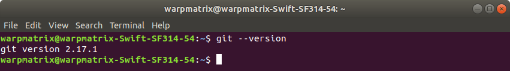

### Command List

使用命令行操作 Git 可以让你更清晰地理解 Git 每一步操作的意义。因此，下面主要使用命令行的形式介绍 Git 的使用。输入```git```可以得到 Git 的命令清单，清单所涉及的英文也比较常用，也可以逐一仔细了解：
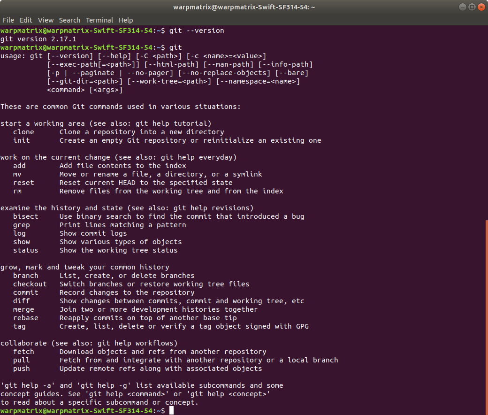

下面我们结合实例，具体介绍几个常用指令。

我们先切换到需要建立仓库的目录下：

```shell
mkdir gittest
cd gittest
```

* ```git status```
指令```git status```可以展示当前工作区的仓库状态，例如：本地机器和缓存之间的异同、缓存中存储的代码更改等。在当前状态下输入```git status```，会有如下提示：
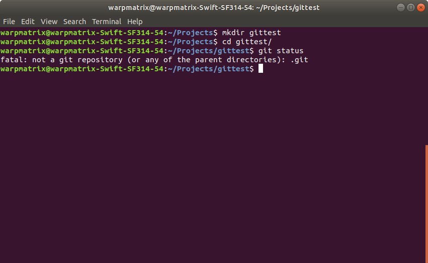
此处意为当前目录还不是一个 git 仓库。

* ```git init```
使用```git init```，可以将当前目录初始化为一个 git 仓库。
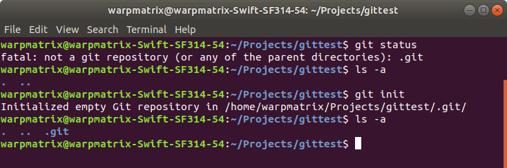
成功初始化后，我们可以看到当前目录新增了一个隐藏文件夹```.git```，里面记录了当前 git 仓库的信息。此时，输入```git status```：
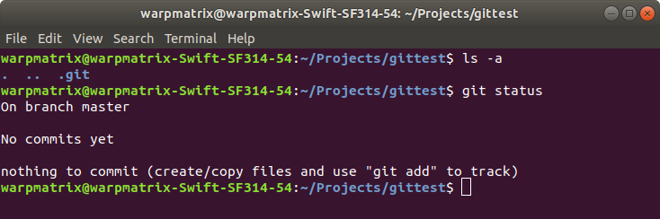
提示我们当前分支信息（分支的概念会在下文的```git branch```进一步解释）、提交记录和缓存信息。

* ```git add```
我们在目录下创建的任意文件，都可以通过```git add```指令提交到缓存当中。当然我们也可以通过```git status```比较，```git add```前后的信息。
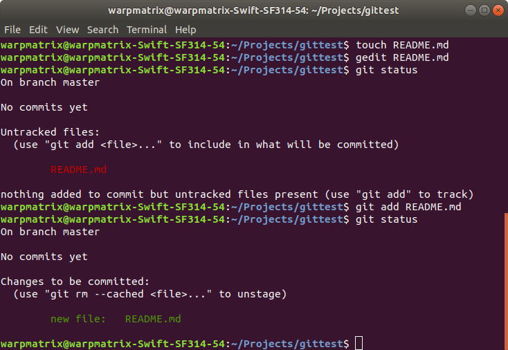
其中，```Untracked files```指没有被跟踪的文件，还没有提交在 git 仓库上的文件。```add```后文件变为```Changes to be committed```，意为文件已经提交到缓存中，等待提交到仓库中。
Ps：我们也可以使用适配符 *，使用```git add *```可以将所有文件一次提交到缓存。

* ```git rm```
上图中我们也可以看到使用```git rm --cached README.md```，可以将这一缓存移除。

* ```git commit```
使用```git commit```可以将缓存中的内容提交到仓库中。
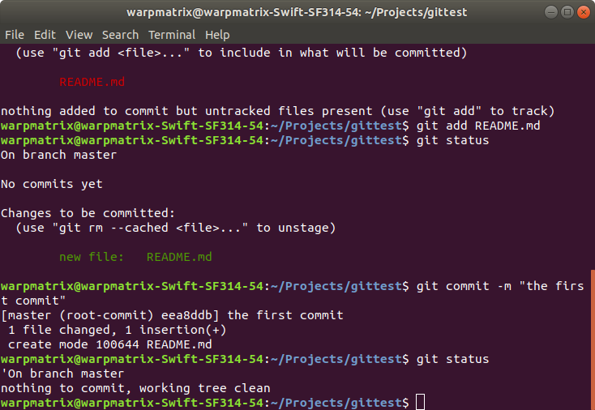
图中```-m```表示提供提交信息，图中提交信息为：the first commit。

* ```git log```
输入```git log```可以查看我们的历史提交信息，包括了作者、时间和提交信息。
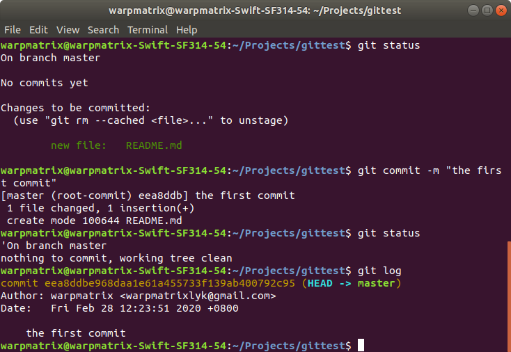

* ```git branch```
    branch 即分支的意思，分支的概念很重要，尤其是团队协作的时候，做同一个项目，这个时候分支就能让团队方便地协同合作。举个例子，A，B俩人都在做同一项目的不同模块，这个时候 A 可以新建了一个分支 a，B 可以新建一个分支 b，这样 A、B 做的所有代码改动都各自在各自的分支，互不影响，等到俩人都把各自的模块都做完了，最后再统一把分支合并起来。

    输入```git branch```可以查看当前分支情况：
    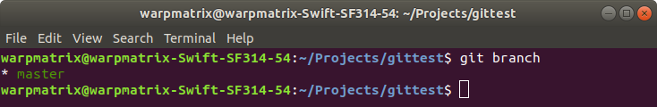
    可以看到我们当前只有一个分支 master，\* 表示我们当前所在分支。

    master 分支是执行```git init```初始化 git 仓库之后会默认生成的主分支，也基本是实际开发正式环境下的分支。一般情况下 master 分支不会轻易直接在上面操作的。

    输入```git branch a```，可以创建一个分支 a：
    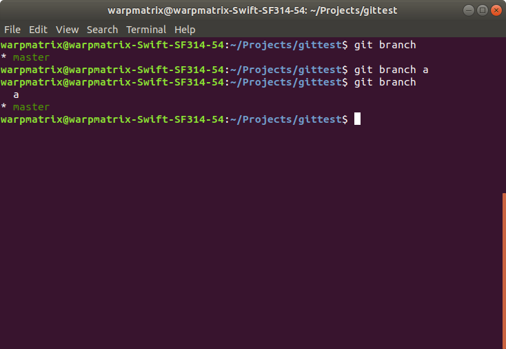
    如果这个分支新建错了，或者 a 分支的代码已经顺利合并到 master 分支来了，a分支没用了，可以输入```git branch -d a```，删除分支 a。
    如果 a 分支的代码还没有合并到 master 分支，使用```git branch -d a```会出现错误，若想要强制删除 a 分支，需要使用```git branch -D a```。

* ```git checkout```
新建分支后，执行```git checkout a```，切换到分支 a。
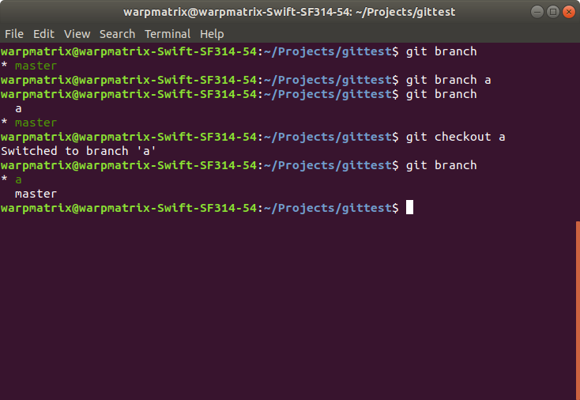
当然，我们也可以新建切换分支一步到位，可以使用指令```git checkout -b a```。

* ```git merge```
当分支上的代码编写完成，并完成提交后。我们可以将该分支合并到主分支上，使用指令```git merge```。首先要做的是将分支切换为主分支 master，再输入```git merge a```指令。
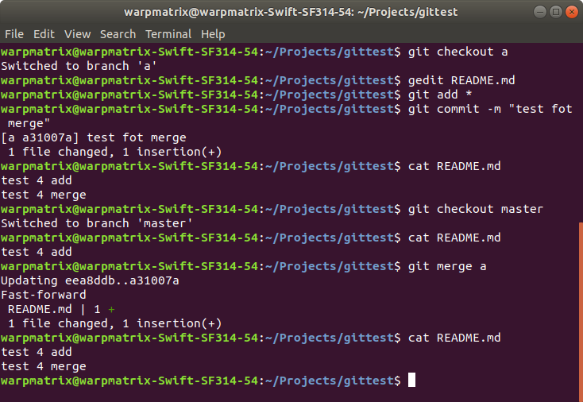

* ```git tag```
    我们还可以给各历史版本加上标签，像是客户端开发的版本号之类的均可。
    使用```git tag```可查看标签；使用```git tag v0```可以增加标签 v0 。
    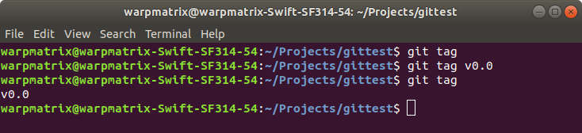

    此外，使用```git checkout```可以实现不同标签之间的切换。

    ```shell
    git checkout v0.0
    ```

## Remote Respository - Github

