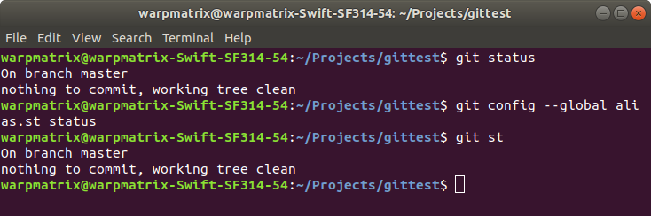
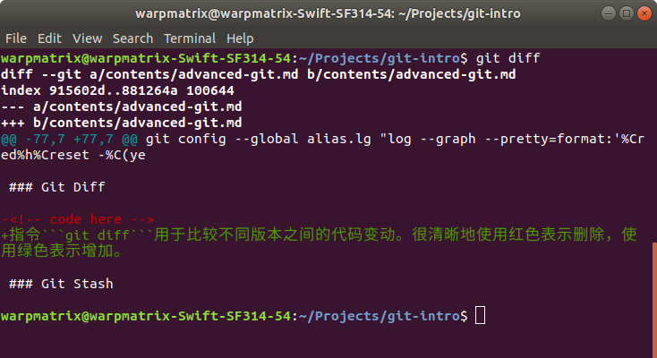
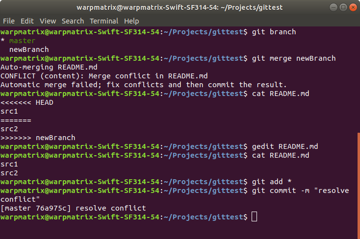

<!-- omit in toc -->
# Advanced Git

<!-- omit in toc -->
## Table of Contents

- [Configuration](#configuration)
  - [Username and Email](#username-and-email)
  - [Alias for Abbreviation](#alias-for-abbreviation)
  - [Advanced Alias](#advanced-alias)
- [More Git Instructions](#more-git-instructions)
  - [Git Stash](#git-stash)
  - [Git Checkout](#git-checkout)
  - [Git Rebase](#git-rebase)
- [Resolving Conflicts](#resolving-conflicts)
- [Summary](#summary)

## Configuration

### Username and Email

我们之前已经使用过```git config```设置相应的用户名和邮箱，这里可以强调等一下。

进行全局设置，可以执行以下指令：

```shell
git config --global user.name "<username>"
git config --global user.email "<email>"
```

如果对特定项目使用特定的用户名和邮箱，可以切换到项目的目录下，将上述的指令删除```--global```参数，重新执行即可。

### Alias for Abbreviation

```git config```除了一些寻常设定可以配置，还有一个强大的功能——设置别名。通过设置别名，我们可以简单便捷地输入指令。

例如，设置```status```的别名为```st```，通过指令：

```shell
git config --global alias.st status
```



我们还可以设置组合，例子如下：

```shell
git config --global alias.psm 'push origin master'
git config --global alias.plm 'pull origin master'
```

当然，以上的别名不是固定的，可以根据自己的习惯设定。

### Advanced Alias

下面介绍 alias 功能强大的一面。

我们执行指令时，可以设置参数，个性化定制我们的指令。

```shell
git log --graph --pretty=format:'%Cred%h%Creset -%C(yellow)%d%Creset %s %Cgreen(%cr) %C(bold blue)<%an>%Creset' --abbrev-commit --date=relative
```

呈现效果见下图，可以看出比起原来的```git log```简洁了不少。


但是每次都需要输入这么长的参数，显然过于繁琐。这个时候 alias 的作用就显现出来了。

```shell
git config --global alias.lg "log --graph --pretty=format:'%Cred%h%Creset -%C(yellow)%d%Creset %s %Cgreen(%cr) %C(bold blue)<%an>%Creset' --abbrev-commit --date=relative"
```

这样下次执行```git lg```即可，调用我们的自定义的```git log```。

以上配置都在```~/.gitconfig```文件下，通过这个文件可以查看、编辑自己的配置，也可以输入```git config -l```命令查看。

## More Git Instructions

### Git Diff

指令```git diff```用于比较不同版本之间的代码变动。很清晰地使用红色表示删除，使用绿色表示增加。



这里需要说明的是，简单的```git diff```用于比较当前文件和缓存区文件的差异，即比较当前文件和已经 add 的内容的差异。

下面介绍```git diff```一些更具体的用法：

```shell
git diff --staged # 比较缓存区和版本库之间的差异
git diff <id1> <id2> # 比较两次提交之间的差异
git diff <branch1> <branch2> # 在两个分支之间比较
```

### Git Stash

stash 的含义是存放、隐藏。```git stash```就是将当前写的代码暂存、隐藏起来。

其主要用于当前代码没有写完，但是因为修复 bug 等因素需要做一次 commit 的情况。因为没有写完的代码没有实际的意义，不建议 commit。这个时候我们的想法就是将修改的代码暂存起来，等到需要时再将其还原。

详细用法如下：

```shell
git stash # 将代码暂存
git stash list # 查看暂存记录
git stash apply # 还原暂存内容
git stash drop # 删除缓存记录
git stash pop # 还原并删除暂存记录
git stash clear # 清空缓存记录
```

```stash```的过程可以理解成一个栈。```apply```、```drop```和```pop```后面都可以接数字，表示操作最近哪一条记录。

### Git Checkout

之前有学习```git checkout```指令可以用于切换分支和标签，除此以外，它还可以作为撤销功能。

可以将其理解为将本地文件切换为**缓存区**里的内容，所以相当于将本地内容撤销。这里特别强调切换的内容是**缓冲区**的内容。

要执行撤销操作，可输入指令：

```shell
git checkout <filename> # <filename>为要进行撤销操作的文件名
git checkout ./ # 对整个文件夹进行撤销操作
```

例如，如果不小心错误调用了```git stash apply```，可以使用```git checkout```进行撤销操作。

### Git Rebase

```git rebase```和```git merge```一样，都用于合并分支。

不过，```git merge```还原了代码的来源分支进行合并；```git rebase```通过时间顺序进行合并，减少分叉的情况出现。

两者各有优劣，依据需要进行选择。

## Resolving Conflicts

开发的过程不可避免会遇到冲突。遇到冲突，自然就需要我们自行解决冲突。

产生冲突的原因是合作的两个人同时更改了同一个地方，Git 本身他没法判断哪个才是正确的版本，这个时候 Git 会智能提示存在 conflicts。



可以看到执行```merge```指令后，存在冲突的地方由```====```分出了上下两个部分，上部分一个叫```HEAD```的字样代表是我当前所在分支的代码，下半部分是一个叫```newBranch```分支的代码。

我们需要做的是移除那些不需要的代码,同时也把那些 ```<<< HEAD```、```====``` 以及 ```>>>>>> newBranch``` 这些标记符号也一起删除,最后进行 add 和 commit 就完成了。

## Summary

以上是一些工程中常用的更进一步的一些技巧、指令等。掌握以上内容也是自己的开发十分有用的，且有必要的。接下来，还会学习分支管理，这些更加系统化、工程化的内容。
