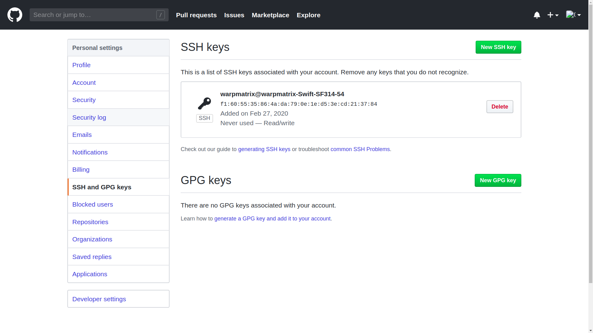
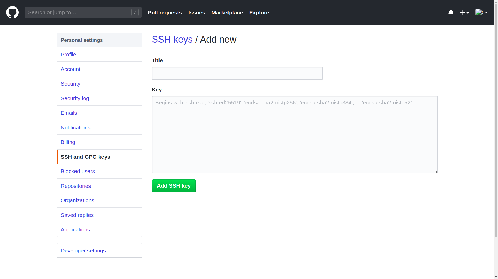
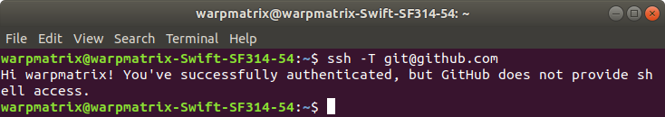
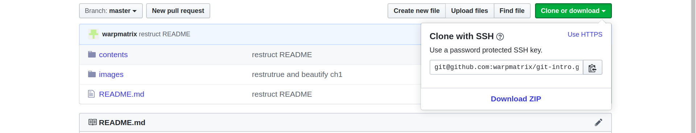

<!-- omit in toc -->
# Remote Respository - Github

<!-- omit in toc -->
## Table of Contents

- [Brief Introduction of Github](#brief-introduction-of-github)
- [SSH Configuration](#ssh-configuration)
  - [Generate SSH Key](#generate-ssh-key)
  - [Add SSH Key on Github、](#add-ssh-key-on-github)
- [Remote Respository Association](#remote-respository-association)
- [Commit your Code](#commit-your-code)
- [总结](#%e6%80%bb%e7%bb%93)

## Brief Introduction of Github

GitHub 主要提供基于 Git 的版本托管服务。Github 作为 Git 的一个远程仓库，托管了无数大牛的项目代码。利用 Github 平台，我们学习无数优秀的开源项目，也可以方便我们进行多人协作开发项目。

## SSH Configuration

当你拥有了一个 GitHub 账号之后，就可以自由的 clone 或者下载其他项目，也可以创建自己的项目，但你无法就此就可以任意提交代码，提交代码之前一定是需要某种授权的，而 GitHub 上一般都是基于 SSH 授权的。

什么是 SSH 呢？简单点说，SSH是一种网络协议，用于计算机之间的加密登录，可以看作一种身份认证。目前是每一台 Linux 电脑的标准配置。而大多数 Git 服务器都会选择使用 SSH 公钥来进行授权，所以想要在 GitHub 提交代码的第一步就是要先添加 SSH key 配置。

### Generate SSH Key

Linux 与 Mac 都是默认安装了 SSH，而 Windows 系统安装了 Git Bash 应该是自带 SSH 的。

在终端（win 下在 Git Bash 里）输入```ssh```。如果出现以下提示，证明你本机已经安装 SSH，否则可自行安装。


接着输入```ssh-keygen -t rsa```，指定 rsa 算法生成密钥，接着可以直接连续三个回车键（不需要输入密码），然后就会生成两个隐藏文件 id_rsa 和 id_rsa.pub。

id_rsa 是密钥，id_rsa.pub 是公钥。这两文件默认分别在如下目录里生成：Linux/Mac 系统 在 ~/.ssh 下，win系统在 /c/Documents and Settings/username/.ssh 下。

接下来要做的是把 id_rsa.pub 的内容添加到 GitHub 上，这样你本地的 id_rsa 密钥跟 GitHub 上的 id_rsa.pub 公钥进行配对，授权成功就可以提交代码。

### Add SSH Key on Github、

在 GitHub 上的个人设置页面，点击最左侧 SSH and GPG keys：


然后点击右上角的 New SSH key 按钮：


在 Key 栏将 id_rsa.pub 公钥文件里的内容粘贴进去，Title 栏可不填，点击 Add SSH key 就 ok 了。

linux 下查看 id_rsa.pub 内容的方式：

```shell
cd ~/.ssh
cat id_rsa.pub
```

添加成功之后，输入```ssh -T git@github.com```进行测试，出现以下提示证明添加成功了。


## Remote Respository Association

添加 SSH key 成功之后，我们就有权限向 GitHub 上我们自己的项目提交代码。在此之前，我们需要将本地仓库和远程仓库关联起来。

本地仓库和远程仓库关联的方法有主要有两种：

- 将自己远程仓库的项目 clone 到本地仓库（可以先将其他人的项目 fork 到自己的远程仓库里）。

    输入指令将远程仓库的项目 clone 到本地：

    ```shell
    git clone <remote-respository-address>
    ```

    其中，```<remote-respository-address>```是远程仓库的地址，可以在下图所示的位置找到：
    

    这里可以选择使用 HTTP 协议或 SSH 协议进行 clone。本例中```<remote-respository-address>```为：```git@github.com:warpmatrix/git-intro.git```。

    将远程仓库 clone 到本地时，这个项目本身就是一个 git 仓库，而且已经关联好远程仓库。

- 在原有的本地仓库添加一个空的远程仓库。

    如果我们已经在本地有一个项目，可以先在 Github 上创建一个空的远程仓库；然后，在本地的 Git 仓库中，执行指令：

    ```shell
    git remote add origin <remote-respository-address>
    ```

    这里的```<remote-respository-address>```和上文一样，是远程仓库的地址。指令的含义是添加一个远程仓库，而 origin 是给这个项目的远程仓库起的名字，名字是为了区分一个项目有多个远程仓库的情况。当然，名字可以随便取，不过大家公认的只有一个远程仓库时名字就是 origin。

    查看当前项目有哪些远程仓库可以使用指令：

    ```shell
    git remote -v
    ```

## Commit your Code

完成上述工作，我们就可以提交我们修改后的代码。

这里需要介绍两条指令：

- ```git push```

    在本地完成 commit 后，我们执行：

    ```shell
    git push origin master
    ```

    意为：把更新的本地代码推到远程仓库，使远程仓库和本地仓库保持同步。

- ```git pull```

    如果别人提交代码到远程仓库，那么就把远程仓库的最新代码拉下来，更新到本地，保证两端代码的同步。

    执行```git pull```指令，与```git push```类似：

    ```shell
    git pull origin master
    ```

    一般我们在 push 之前都会先 pull，这样不容易冲突。

## 总结

通过上述配置，就可以实现本地仓库连接到远程仓库，具备和别人一起协同合作的条件。不过，要想更高效地合作或是面对任何情况都不出纰漏，还需要进一步学习。

接下来还会学习 Git 的一些有用的配置、技巧等，让自己掌握的知识逐渐系统起来。
